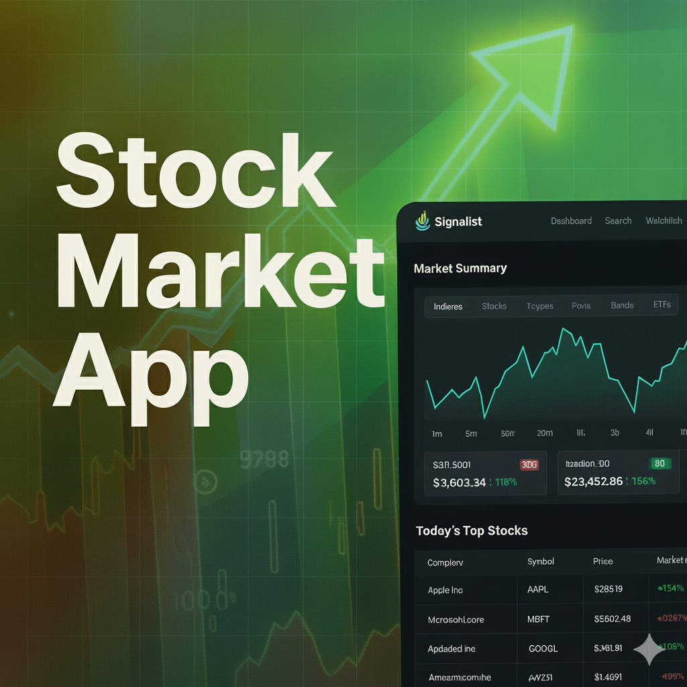

🚀 Signalist — Modern AI-Powered Stock Market App

 

  

     

 
  
<h3 align="center"> AI-Powered Stock Tracking, Alerts, Insights & Real-Time Market Intelligence </h3> 
<a href="https://signalist-dev.vercel.app/" target="_blank"> 🔥 <b>Live Demo</b> </a> 

📋 Table of Contents

✨ Introduction

⚙️ Tech Stack

🔋 Features

🤸 Quick Start

📡 Environment Variables

🧱 Architecture Overview

📎 Assets

🚀 More

<a name="introduction">✨ Introduction</a>

Signalist is a powerful, modern, AI-enhanced stock market platform built with Next.js, Better Auth, Inngest, and Finnhub.

It enables users to:

Track real-time price movements

Manage a custom watchlist

Receive automated AI-generated market summaries

Explore deep company insights

Monitor news, trends, alerts, technicals, and fundamentals

The project is designed with clean architecture, server actions, event-driven workflows, and enterprise-grade best practices, making it an excellent real-world showcase for modern full-stack engineering.

<a name="tech-stack">⚙️ Tech Stack</a>
Frontend

Next.js 15 (App Router)

Shadcn/UI

TailwindCSS

TypeScript

Backend

Next.js Server Actions

Better Auth

MongoDB + Mongoose

Nodemailer

Inngest (background jobs / workflows)

Gemini AI (AI summaries, AI insights)

APIs

Finnhub — Stock market data

Custom AI workflow using Gemini

Server-side alerts & triggers

<a name="features">🔋 Features</a>
🧭 Dashboard & Market Tracking

Real-time stock quotes

Candlestick charts & historical data

Price, volume, and performance indicators

🔍 Powerful Search System

Intelligent search with debounced lookups

Exchange/type-aware symbol search

Optimized symbol deduping

⭐ Watchlist

Add/remove stocks with a star toggle

Syncs instantly with backend

Personalized watchlist dashboard

🔔 Smart Alerts & Automation

Scheduled AI-generated daily summaries

Price movement alerts

Volume spike alerts

Event-driven insights via Inngest

🧠 AI-Powered Features

Gemini-based daily market digest

Company summary generation

Market sentiment scoring

📊 Company Insights

Business profile

Key metrics & ratios (PE, EPS, Revenue, etc.)

News, filings, analyst ratings

🛠️ Admin Tools (Optional)

Publish news

Manage stock metadata

View user activity

<a name="quick-start">🤸 Quick Start</a>
1. Clone the Repository
git clone https://github.com/Pratham22R/Stock_Tracker_App.git
cd pratham22r-stock_tracker_app

2. Install Dependencies
npm install

3. Set Up Environment Variables

Create .env in the project root:

NODE_ENV='development'
NEXT_PUBLIC_BASE_URL=http://localhost:3000

# FINNHUB
NEXT_PUBLIC_FINNHUB_API_KEY=
FINNHUB_BASE_URL=https://finnhub.io/api/v1

# MONGODB
MONGODB_URI=

# BETTER AUTH
BETTER_AUTH_SECRET=
BETTER_AUTH_URL=http://localhost:3000

# GEMINI
GEMINI_API_KEY=

# NODEMAILER
NODEMAILER_EMAIL=
NODEMAILER_PASSWORD=

Make sure all values are filled correctly.

4. Run the App
npm run dev

5. Run Inngest Dev Mode
npx inngest-cli@latest dev

Your local instance should be running at 👉 http://localhost:3000

<a name="env">📡 Environment Variables Explained</a>
Variable	Purpose
FINNHUB_API_KEY	Real-time market data
GEMINI_API_KEY	AI summaries & insights
MONGODB_URI	Database connection
BETTER_AUTH_*	Authentication secrets
NODEMAILER_*	Email notifications
INNGEST_*	Background job triggers
<a name="architecture">🧱 Architecture Overview</a>
🧩 Frontend

React Server Components (RSC)

Tailwind + Shadcn system

Modular UI components

Reusable chart widgets

🤖 Backend

Next.js server actions

Rate-limited API calls

Efficient Finnhub wrappers

Nodemailer for transactional emails

⚡ Workflows (Inngest)

Daily AI Market Digest

Earnings alerts

Watchlist alert pipelines

📦 Database Layer

MongoDB + Mongoose schema models

Optimized for speed & minimal roundtrips

Watchlist & profile collections

🔐 Authentication

Powered by Better Auth, featuring:

Password login

OAuth readiness

Secure sessions

<a name="links">📎 Assets</a>

All asset files (such as the banners) live inside:

public/readme/*

<a name="more">🚀 More</a>
👨‍💻 Want to contribute?

Open PRs and issues are welcome!
The project follows a clean structure and is ideal for:

beginners exploring Next.js

devs building financial apps

engineers interested in AI + event-driven systems

⭐ Show Support

If you like the project, star the repo — it helps a lot!